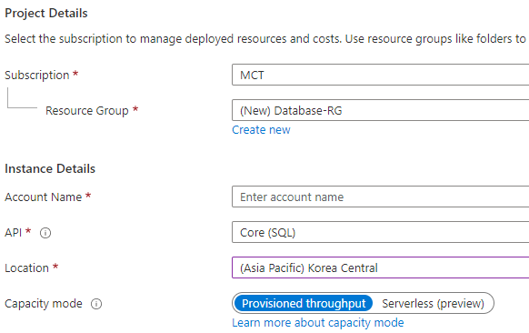
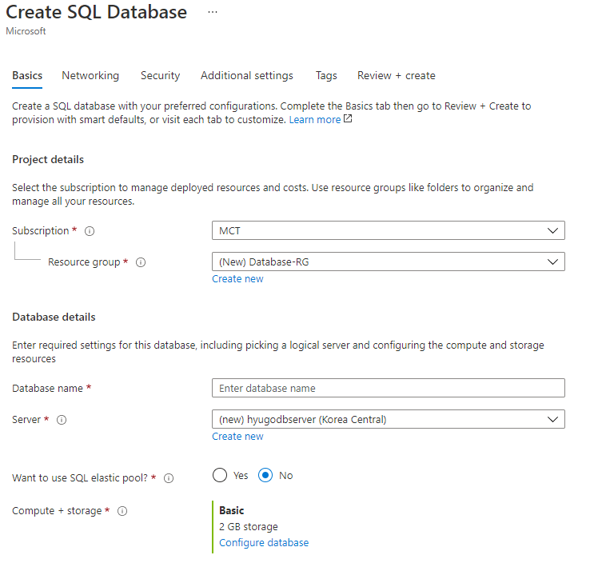
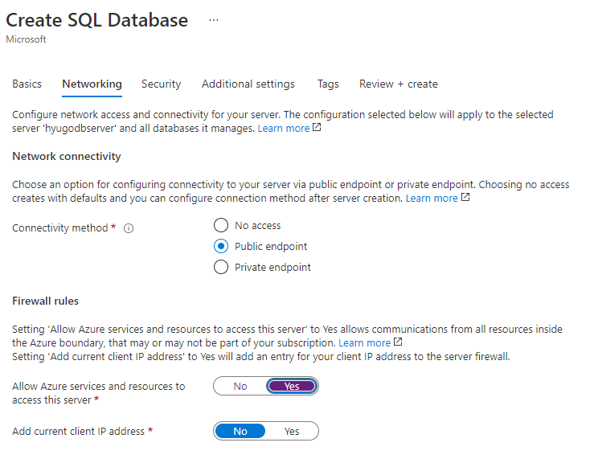
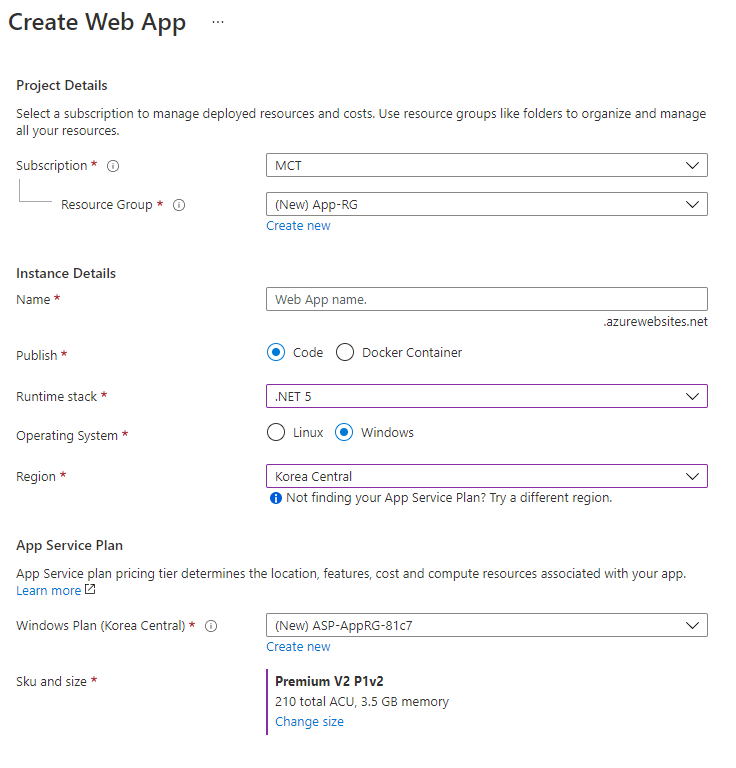
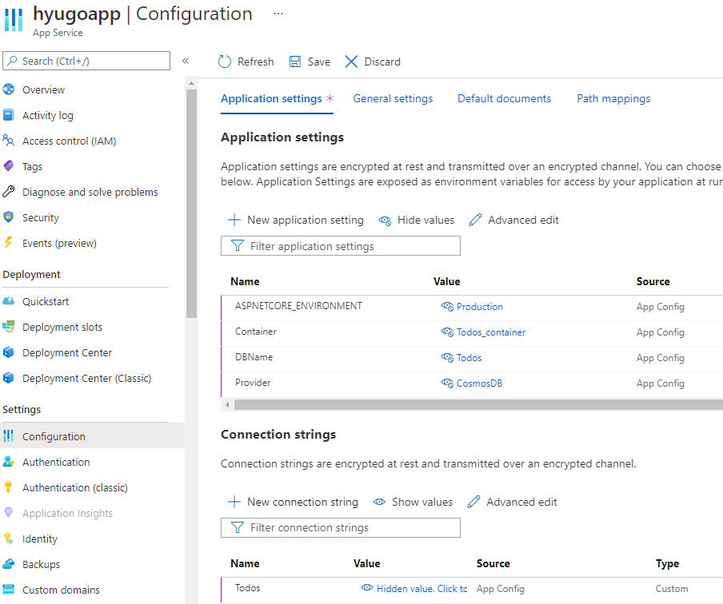

Azure App Service Deploy HOL
====================
## 1. Azure Resource Deploy
### **1.1. [Terraform Deploy](./terraform/)**
### **1.2. Portal Deploy** 

접기/펼치기

**위치 : Azure Potal 메인 - Create a resource 블레이즈**  

**선택1.** Cosmos DB 리소스 생성 

  
**리소스 정보**  
  
**Project details**
- Subscirption : 사용 가능한 구독
- Resource Group : Create New -> Database-RG

**Instance Details**
- Account Name:`<DB Server Name>`
- API: Core(SQL)
- Location: Korea Central

**Cosmos DB Database 생성 및 Container 생성**
- Cosmos DB 리소스에서 Data Explorer 블레이즈에 New Container
- Database id: Todos
- Container id: Todos_container
- Partition key: /_todos_key  
  
**`<Connection String>` 가져오기**
- Cosmos DB 리소스에서 Keys 블레이즈에 PRIMARY CONNECTION STRING 값 `<Connection String>` 사용

  
********************  
**위치 : Azure Potal 메인 - Create a resource 블레이즈**  
  
**선택2.** Azure SQL DB 리소스 생성  

  
**리소스 정보**  
  
**Project details**
- Subscirption : 사용 가능한 구독
- Resource Group : Create New -> Database-RG

**Database details**
- Database name: Todos
- Server: Create New -> `<DB Server name>`, `<Server admin login>`, `<Password>`, location: Korea Central
- Compute + stroage: Basic / 2G  
  

  
**Network 탭**
  
**Network Connectivity**
- Connectivity method: Public endpoint
  
**Firewall rules**
- Allow Azure services and resources to access this server: yes

**`<Connection String>` 가져오기**
- Azure SQL 데이터베이스 Todos 리소스 - Connection Strings 에서 ADO.NET 탭 `<Connection String>` 사용

********************  
**위치 : Azure Potal 메인 - Create a resource 블레이즈**  
Web App 리소스 생성

  
**리소스 정보**  
  
**Project Details**
- Subscirption : 사용 가능한 구독
- Resource Group : Create New -> App-RG
  
**Instance Details**
- Name : `<appservice_name>`
- Publish : code
- Runtime stack : .NET 5
- Operating System : Windows
- Region : Korea Central  
  
**App Service Plan**
- Windows Plan (Korea Central) : default
- Sku and size : Premium V2 P1v2

**Monitoring Tab**  
  
**Applcation Insight**  
- Enable Application Insights : No
  

**Application Settings**
- name: ASPNETCORE_ENVIRONMENT  
  value: Production
    
- name: Container  
  value: Todos_container
    
- name: DBName  
  value: Todos
    
- name: Provider  
  value: CosmosDB / SQLAzure
    
**Connection Strings**
- Name: DBName  
  Value: DB 생성 후 가져온`<Connection String>`  
  Type: Custom(CosmosDB) / SQLAzure(Azure SQL)
  

*****************
## **2. [Deploy Appliation](./dotnet-db-tutorial/)** 
