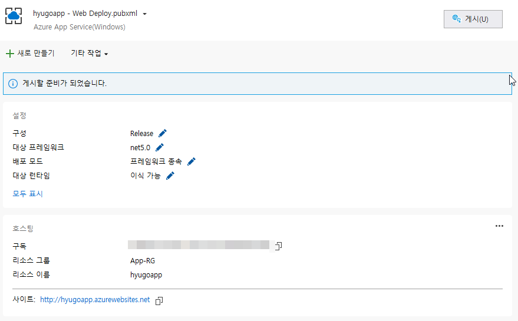

# Azure App Service Deploy HOL: Terraform Deploy: Deploy Application
## 선행작업
- Git 설치
- `git clone https://github.com/jkl2554/azure-appservice-deploy-HOL.git`
- [Azure Resource Deploy](../README.md) 수행
## 1. Visual Studio 게시
### 선행작업
- visual studio 2019이상 버전 설치

### 배포 수행 

- ./dotnet-db-tutorial/DotNetCoreSqlDb.csproj 로드
- Visual Studio 솔루션 탐색기에서 프로젝트 우클릭 -> 게시
- 게시 창에서 Azure -> Azure app service(Windows) -> [Azure Resource Deploy](../README.md)단계에서 생성한 App Service선택 -> 게시

## License

See [LICENSE](LICENSE.md).