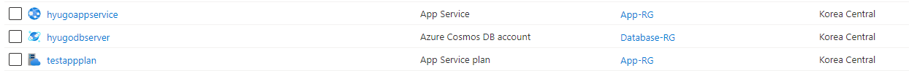
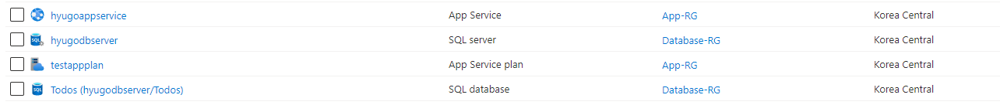

# Azure App Service Deploy HOL: Terraform Deploy
## 선행 작업 
- 배포 할 수 있는 Azure 구독 Contributor이상의 권한
- Azure CLI login  
  
```
az login

az account set -s <subsciptionId or subscriptionName>
```

- [Terraform 설치](https://learn.hashicorp.com/tutorials/terraform/install-cli)

## 앱 세팅 설정 값
### 환경 변수

| 이름 | 값 | 의미 |
|-------------------------|---------------------------|---------------------|
|ASPNETCORE_ENVIRONMENT   | Production / Development  |애플리케이션 환경      |
|Container                | Todos_container           |CosmosDB컨테이너 이름  |
|DBName                   | Todos                     |데이터베이스 이름      |
|Provider                 | CosmosDB / SQLAzure       |데이터베이스 종류      |

### 연결 문자열

| 이름 | 데이터베이스 타입 | 값 |
|------|------------------|------------------|
|Todos |Custom / SQLAzure |(sensitive value) |


## 설정 변경
[variables.auto.tf](variables.auto.tf)
```
DB_type = <"CosmosDB" or "SQLAzure">
dbserver_name = <DB Server 이름>
appservice_name = <App Service 이름>
env = <"Production" or "Development">
```
*\* `dbserver_name` `appservice_name` 중복되지 않는 값 설정 필요*  
*\*\* `env` 설정에 따라 애플리케이션 에러 표시 여부 결정*  
    
또는   
  
`terraform apply` 에 다음명령어 추가 `-var="DB_type=CosmosDB"` or `-var="DB_type=SQLAzure"`

## Terraform을 통한 리소스 배포
```
terraform init

terraform apply
```
## Portal 에서 리소스 생성 확인
 - `DB_type=CosmosDB`

 - `DB_type=SQLAzure`


## 리소스 정리
```
terraform destroy
```